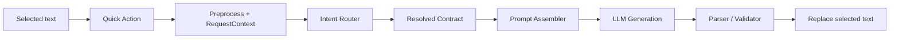
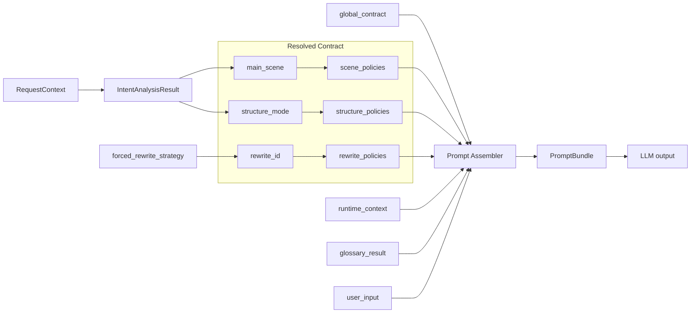

# Voice2Code

Voice2Code is a macOS-focused voice-to-instruction refiner for developer workflows.

It is built for a simple workflow:

1. dictate or paste rough text into any macOS text field
2. select the text
3. trigger a Quick Action
4. replace the selection with a cleaner instruction

## Why This Exists

Voice input is fast, but spoken engineering text is usually noisy:

- filler words
- misrecognized technical terms
- weak structure
- unclear action / condition / scope boundaries

Voice2Code keeps the interaction local and lightweight, then uses an LLM to turn rough text into something you can actually reuse in engineering workflows.

## Highlights

- **Cross-app Quick Action**
  Works through `AI提纯指令.workflow`, so the same trigger can be used across macOS text fields.
- **Minimal app shell**
  `Voice2Code.app` is only a small control shell for setup, provider selection, network config, and runtime entry.
- **Structured refinement core**
  The Python refiner core keeps the current architecture focused on:
  - two-stage intent + generation
  - bilingual contracts
  - provider-neutral execution

## Core Flow



This is the core value of the project:

- keep the entry point simple
- keep routing minimal
- keep generation contract-driven
- return a directly usable result back into the current text field

## Why The Contract Layer Matters



This is where Voice2Code is better than a simple single-prompt rewrite tool:

- stage 1 only decides the minimum routing fields
- stage 2 does **minimal dynamic assembly**, not full template stuffing
- local code does deterministic parsing and validation, instead of semantic over-correction

## Current Shape

Current delivery shape:

- `Quick Action + Voice2Code.app`

Current release goal:

- **stable local delivery**
- not a fully packaged notarized macOS app

Current provider state:

- Gemini is the primary release baseline
- OpenAI is integrated and minimally validated
- Doubao is integrated in code but still needs real-key validation

## Quick Start

Build the current installer locally:

```bash
python3 scripts/build_dist.py
```

Main references:

- [PRD](docs/Voice2Code_PRD.md)
- [Architecture](docs/Voice2Code_Architecture.md)
- [Implementation Checklist](docs/Voice2Code_Implementation_Checklist.md)
- [Project Closeout Checklist](docs/Voice2Code_Project_Closeout_Checklist.md)
- [Contributing](CONTRIBUTING.md)

## Demo


## Install Shape

The current installer flow is intentionally simplified into two stages:

1. install confirmation
2. initialization window
   - provider selection
   - direct / proxy choice
   - API key input
   - connectivity test
   - automatic refinement smoke test
   - in-window completion state

The successful path no longer opens a third standalone completion dialog.

## Repository Layout

Top-level folders:

- [`config/`](config/) runtime configuration
- [`docs/`](docs/) architecture, PRD, implementation and closeout docs
- [`scripts/`](scripts/) build, installer, app shell, and refiner code
- [`tests/`](tests/) regression, smoke, and evaluation tooling

## Current Boundaries

This repository is in **closeout / stabilization** phase.

In scope:

- stable install flow
- Quick Action registration
- initialization flow
- provider selection / network config / connectivity test
- regression, token smoke, and quality evaluation assets

Not a current release gate:

- full macOS app notarization
- complete `SecItem* + codesign + entitlement` delivery
- stronger system-level secret persistence guarantees
- plugin productization

## Build and Validation

Common local commands:

```bash
python3 scripts/build_dist.py
python3 tests/run_voice2code_regression.py
python3 tests/run_voice2code_token_smoke.py
python3 tests/run_voice2code_quality_eval.py
```

The build produces versioned installer artifacts under `dist/`.

## Security / Credentials

Voice2Code does **not** ship with embedded provider keys.

Current behavior:

- environment variables can explicitly provide provider API keys
- the app shell may persist configuration when the current environment supports it
- plaintext API keys are not written into repo config files

Important boundary:

- this repository does **not** currently claim that system-level seamless secure storage is fully solved as a release guarantee

## License

This project is licensed under the Apache License 2.0. See [`LICENSE`](LICENSE).
