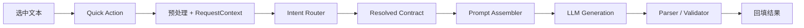
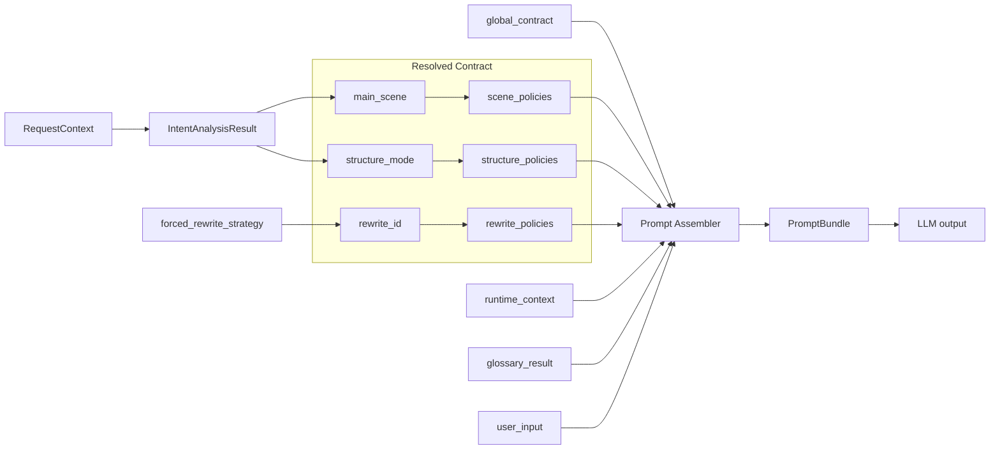
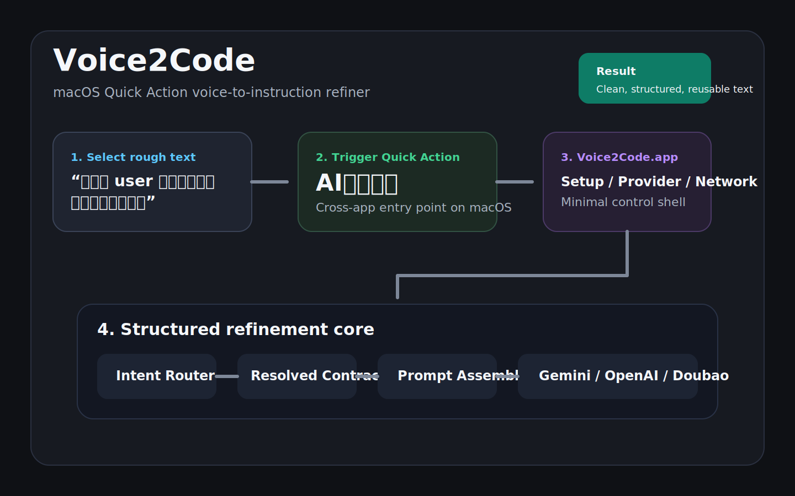

# Voice2Code

[English](README.md) | [简体中文](README.zh-CN.md)

Voice2Code 是一个面向 macOS 开发者工作流的“语音转指令”提纯工具。

它对应的典型使用流程很简单：

1. 在任意 macOS 输入框中口述或粘贴一段粗糙文本
2. 选中文本
3. 触发 Quick Action
4. 将当前选区替换为更清晰、更结构化的结果

## 为什么做这个项目

语音输入很快，但工程语境下的口述文本通常会有这些问题：

- 语气词和废话多
- 技术术语容易误识别
- 动作、条件、边界不够清楚
- 很难直接作为任务、Issue、PR 描述或提示词使用

Voice2Code 的目标不是“陪聊式 AI”，而是尽量用轻量、本地、低切换成本的方式，把粗糙输入整理成真正可用的工程文本。

## 核心特点

- **跨应用 Quick Action**
  通过 `AI提纯指令.workflow` 作为入口，可在 macOS 多种文本输入场景中触发。
- **最小 App 控制壳**
  `Voice2Code.app` 只负责初始化配置、Provider 选择、网络方式和本地运行入口。
- **结构化提纯核心**
  本地 Python Refiner Core 负责：
  - 两阶段路由与生成
  - 双语 contract
  - provider-neutral 执行

## 主流程



这张图体现的是项目真正的价值点：

- 入口简单
- 第一层路由尽量小
- 第二层按 contract 最小组装
- 结果直接回写到当前文本框

## 为什么 Contract 层重要



这也是 Voice2Code 和“单 prompt 直接改写”工具的主要区别：

- 第一层只输出最小路由字段
- 第二层做的是**最小动态组装**，不是把所有模板一次性塞进 prompt
- 本地代码只负责确定性解析与校验，不做语义过度修补

## 当前形态

当前交付形态：

- `Quick Action + Voice2Code.app`

当前发布目标：

- **稳定可交付**
- 而不是完整公证的 macOS 正式 App

当前 Provider 状态：

- Gemini 是正式发布主基线
- OpenAI 已接入并完成最小验证
- Doubao 已在代码层接入，但仍待真实 key 验证

## 快速开始

本地构建当前安装包：

```bash
python3 scripts/build_dist.py
```

主要文档入口：

- [PRD](docs/Voice2Code_PRD.md)
- [Architecture](docs/Voice2Code_Architecture.md)
- [Implementation Checklist](docs/Voice2Code_Implementation_Checklist.md)
- [Project Closeout Checklist](docs/Voice2Code_Project_Closeout_Checklist.md)
- [Contributing](CONTRIBUTING.md)

## Demo



## 安装形态

当前安装器已经收简为两个阶段：

1. 安装确认
2. 初始化配置窗口
   - Provider 选择
   - 直连 / 代理配置
   - API Key 输入
   - 连通测试
   - 自动转写烟测
   - 同窗完成态

成功路径不会再额外弹出第三个独立完成弹窗。

## 仓库结构

顶层目录：

- [`config/`](config/) 运行时配置
- [`docs/`](docs/) 架构、需求、实施与收尾文档
- [`scripts/`](scripts/) 构建、安装器、App 壳与 refiner 代码
- [`tests/`](tests/) 回归、烟测与质量评测工具

## 当前边界

当前仓库处于 **收尾 / 稳定化** 阶段。

当前明确在范围内：

- 安装流程稳定性
- Quick Action 注册
- 初始化配置闭环
- Provider / 网络 / 连通测试
- 回归、token smoke、质量评测资产

当前不作为发布门禁：

- 完整 notarization
- 完整 `SecItem* + codesign + entitlement`
- 更高等级的系统级无感安全存储
- 插件产品化路线

## 构建与验证

常用本地命令：

```bash
python3 scripts/build_dist.py
python3 tests/run_voice2code_regression.py
python3 tests/run_voice2code_token_smoke.py
python3 tests/run_voice2code_quality_eval.py
```

版本化安装产物位于 `dist/` 目录。

## 安全与凭据

Voice2Code **不会**内嵌 provider API key。

当前行为：

- 可通过环境变量显式提供 provider API key
- App 控制壳会在当前环境支持时尝试持久化配置
- 仓库配置文件中不保存明文 API key

需要明确的边界：

- 当前仓库**不宣称**系统级无感安全存储已经作为正式发布保证完全解决

## 开源协议

本项目采用 Apache License 2.0。详见 [LICENSE](LICENSE)。
