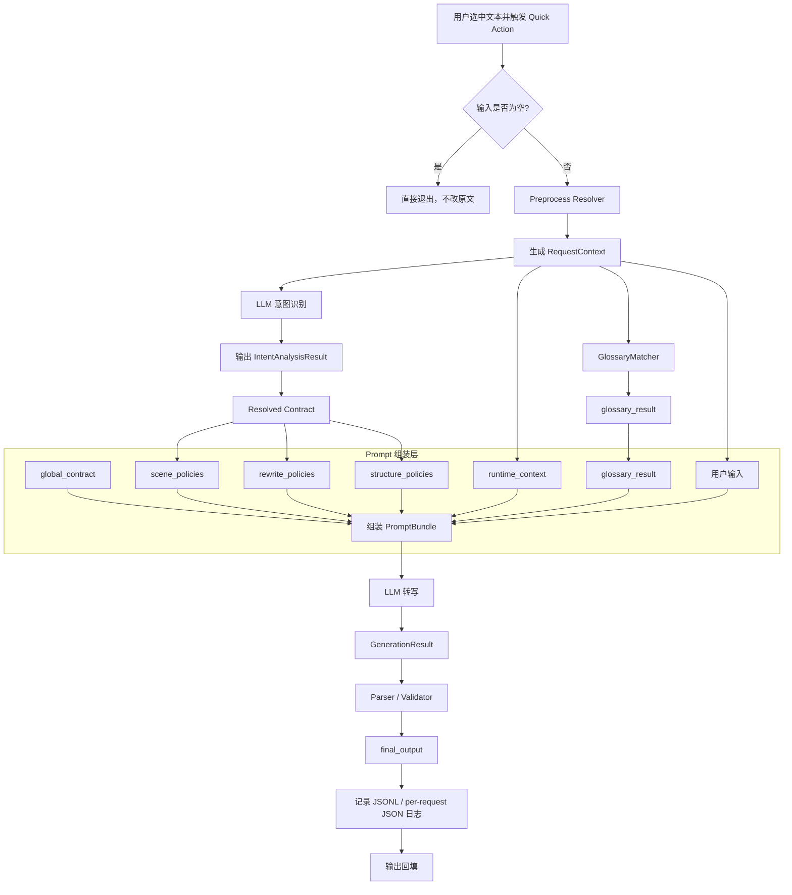
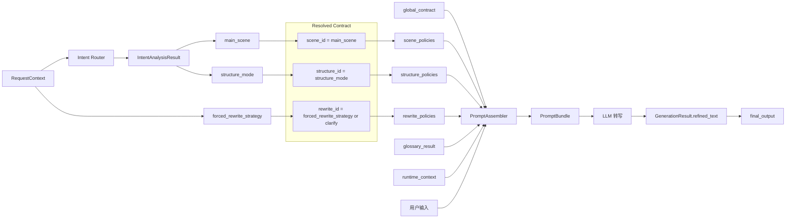

# Voice2Code Refiner 架构设计文档

## 1. 文档目标

本文档用于沉淀 Voice2Code 当前正式采用的 V2 规范架构，明确：

- 系统的目标分层和模块职责
- 输入到输出的规范数据流
- 第一层与第二层之间的 contract 边界
- 日志、配置、安装器等配套能力的职责位置

目标场景固定为：

- `Cursor / antigravity / 通用 AI 对话输入整理`
- 核心目标是提升 AI 转写质量，让输入更适合被 AI 分析、确认、执行或产出
- 不以普通聊天润色或日常写作美化为目标

本文档描述的是当前规范架构，不记录历史实现妥协。

配套实施清单见：[Voice2Code_Implementation_Checklist.md](/Users/yifeiliu/cursor/AIO/ai_command_optimization/docs/Voice2Code_Implementation_Checklist.md)

## 2. 架构结论

从用户理解角度，整体系统仍然是两层：

1. 意图识别层
2. AI 转写层

但从工程设计角度，V2 已经收敛为 6 个运行模块，否则“两层”这个说法会掩盖真正的职责边界。

### 2.1 逻辑分层

1. `Preprocess Resolver`
2. `Intent Router`
3. `Resolved Contract`
4. `Prompt Assembler`
5. `Generation + Parser`
6. `Logging`

### 2.2 分层说明

#### Preprocess Resolver

- 读取原始输入
- 解析显式前缀：
  - `preserve:`
  - `clarify:`
  - `rewrite:`
- 规范化可选 `runtime_context`
- 生成 `RequestContext`

该层只处理高确定性逻辑，不做语义理解。

#### Intent Router

- 发布主基线模型：`gemini-3.1-flash-lite-preview`
- 只判断：
  - `main_scene`
  - `structure_mode`

Provider-neutral 形态下，第一层已支持：

- `gemini`
- `openai`
- `doubao`

但当前正式发布主基线仍固定为 `Gemini`。

该层不再承担：

- `rewrite_strategy`
- `output_format`
- `confidence`

也不再用长决策表式 prompt 解释所有例外。

#### Resolved Contract

- 接收第一层结果和代码默认值
- 生成第二层唯一消费的 contract

固定解析规则为：

- `scene_id = main_scene`
- `structure_id = structure_mode`
- `rewrite_id = forced_rewrite_strategy or "clarify"`

这是 V2 的关键中间层，也是第一层与第二层真正解耦的位置。

#### Prompt Assembler

- 按 resolved contract 选择最小策略片段
- 组装第二层 payload

它只负责 contract 组装，不重新承担路由职责。

#### Generation + Parser

- 发布主基线模型：`gemini-3.1-flash-lite-preview`
- 负责生成：
  - `refined_text`
  - `self_check`
- 本地只做 JSON 解析与字段校验

Provider-neutral 接入层会根据当前 provider 选择对应 adapter，但仍保持：

- 同一 provider 同时承载 `intent + generation`
- 不做跨 provider 混用

该层之后不再接本地语义修补链。

#### Logging

- 记录输入、路由结果、resolved contract、token、延迟和最终输出
- 支撑质量回归、并发校验与成本分析

## 3. 部署形态

相关运行资产如下：

- 安装脚本：[install_workflow.py](/Users/yifeiliu/cursor/AIO/ai_command_optimization/scripts/install_workflow.py)
- 发布安装包：`dist/Voice2Code_安装包_<version>.zip`
- 产品需求文档：[Voice2Code_PRD.md](/Users/yifeiliu/cursor/AIO/ai_command_optimization/docs/Voice2Code_PRD.md)
- 生成的 Quick Action：`~/Library/Services/AI提纯指令.workflow`
- 术语词典：`~/Library/Application Support/Voice2Code/terminology_glossary.json`
- 聚合日志：[`/private/tmp/Voice2Code_debug.jsonl`](/private/tmp/Voice2Code_debug.jsonl)
- 单请求日志目录：`/tmp/Voice2Code_logs/`

## 4. 运行流程

本节只描述规范架构，不描述实现偏差。

### 4.1 主流程图

### 4.2 Contract 组合图

### 4.3 设计说明

这两张图分别回答两个不同问题：

- 主流程图
  - 用来说明系统的规范处理链路
  - 重点是“输入 -> 路由 -> contract -> 组装 -> 转写 -> 解析 -> 输出”
- Contract 组合图
  - 用来说明第二层不是直接读取第一层原始结果，而是消费 resolved contract
  - 重点是“scene / structure 由第一层判断，rewrite 由代码默认值补齐”

规范结论固定如下：

1. 第一层是最小语义路由，不是长说明书式分类器
2. 第二层动态组装必须发生在第一层之后
3. 第二层只消费 resolved contract，不直接消费第一层全部原始结果
4. `rewrite_strategy` 不再是第一层判断维度，而是 `forced_rewrite_strategy or "clarify"`
5. 本地代码不再承担输出形态强修补或语义守护
6. 日志必须同时服务于人工排查和程序分析，因此采用 `JSONL + per-request JSON`

### 4.4 六个场景的动态组装说明

第二层的动态组装，不是把 6 个场景的完整模板全部塞进一次请求里，而是：

1. 第一层先输出单个 `main_scene`
2. `Resolved Contract` 将其解析为单个 `scene_id`
3. 第二层只加载该场景对应的一条 `scene_instruction`
4. 再叠加当前请求唯一对应的：
   - `rewrite_instruction`
   - `structure_instruction`
   - `global_contract`
   - `runtime_context`
   - `glossary_result`
   - `user_input`

也就是说，第二层是“按单场景命中后最小组装”，而不是“全场景注册表注入”。

6 个主场景在第二层中的职责如下：

#### `general`

- 用于提醒、保留意见、风险提示、节奏判断
- 目标是提炼“当前判断 + 保留边界”，而不是把内容任务化
- 动态组装重点：
  - 保留原判断语气
  - 不额外扩写成执行请求
  - 默认优先自然表达

#### `task`

- 用于执行动作、修改要求、工程实现、交付动作
- 目标是把输入整理成更适合 AI 执行的任务表达
- 动态组装重点：
  - 保留动作、条件、限制、预期结果
  - 不凭空新增交付物或实施计划
  - 在 `structured` 下允许分步骤展开

#### `question`

- 用于提问、求判断、求解释、求评估
- 目标是保留问句属性，让问题更清楚，而不是改写成任务
- 动态组装重点：
  - 保留问题焦点
  - 保留判断维度
  - 在多问题点时按 `structured` 分项展开

#### `discussion_confirm`

- 用于确认理解、对齐边界、确认方案认知是否正确
- 目标是把“当前理解 + 待确认点”整理清楚
- 动态组装重点：
  - 保留“我当前理解是……”这类确认语气
  - 不改写成任务下发
  - 在多点确认时保持分点和收束式提问

#### `doc`

- 用于整理、补充、沉淀文档或架构说明
- 目标是明确目标产物、范围边界和关注点
- 动态组装重点：
  - 保留文档产出目标
  - 保留范围边界
  - 不主动扩写未提及模块，不把文档要求写成冗长限制清单

#### `feedback_meta`

- 用于约束 AI 的回复方式、表达风格和沟通边界
- 目标是提炼“怎么回复 / 不要怎么回复”
- 动态组装重点：
  - 抽取沟通要求和禁止项
  - 保持自然、直接，不写成生硬规章
  - 不把反馈元信息误转成任务内容

因此，6 个场景在当前架构中的真正作用不是“6 套大模板”，而是：

- 先用第一层确定当前请求的唯一主目标
- 再用第二层只组装这一条主目标对应的最小场景契约

### 4.5 当前架构设计的核心逻辑与原因

当前 V2 的核心逻辑，可以概括为三句话：

1. 把高确定性逻辑留在代码里
2. 把低确定性语义判断交给第一层 LLM
3. 把真正的表达生成收敛到第二层最小 contract 里

之所以这样设计，原因有四个：

#### 第一，避免第一层变成“说明书式分类器”

旧设计里，第一层为了同时判断多个维度，会不断增长：

- 决策表
- 长规则
- 各种边界解释

结果是：

- token 成本过高
- prompt 语义重复
- 对 `gemini-3.1-flash-lite-preview` 这类轻量模型不友好

因此，V2 把第一层收敛成最小语义路由器，只判断最值得交给 LLM 的两个维度：

- `main_scene`
- `structure_mode`

#### 第二，避免第二层继续堆全量模板

如果第二层直接读取：

- 全部场景模板
- 全部改写规则
- 全部结构规则

那所谓“动态组装”最终仍会退化成长文案堆叠。

因此，V2 引入 `Resolved Contract`，让第二层只消费：

- 一个场景
- 一个改写策略
- 一个结构模式

这能保证第二层始终是“单目标、最小组装”。

#### 第三，避免本地代码重新介入语义输出

本地代码擅长做确定性事情，例如：

- 前缀解析
- 配置读取
- JSON 校验
- 日志记录

但不适合继续做：

- 场景重判
- 句式重写
- 结构补齐
- 语义守护式强修补

所以 V2 明确把本地职责收回到：

- preprocess
- contract resolve
- parser / validator
- logging

不再让本地代码成为“第三个隐形转写层”。

#### 第四，让架构更适合长期演进

当前设计虽然仍然是两层，但内部 contract 已经更稳定：

- 第一层负责“这是什么类型的输入”
- 第二层负责“按这个类型怎样最小组装并生成”

这样后续如果要继续优化：

- 某个主场景
- 某个结构模式
- 某个改写策略
- 某组日志字段

都可以在单个层面内收敛，而不用再牵动整套 prompt 体系。

这就是当前架构最核心的原因：

- 不是把功能做得更复杂
- 而是把职责重新划回正确层级，让“第一层意图识别 + 第二层动态组装”真正成立

## 5. 核心协议对象

### 5.1 RequestContext

输入上下文对象，包含：

- `request_id`
- `input_text`
- `runtime_context`
- `forced_rewrite_strategy`
- `glossary_mode`
- `glossary_max_entries`
- `intent_model`
- `generation_model`
- `api_key`

### 5.2 IntentAnalysisResult

第一层最小路由结果：

| 字段 | 类型 | 说明 |
| --- | --- | --- |
| `main_scene` | `enum` | `general / task / question / discussion_confirm / doc / feedback_meta` |
| `structure_mode` | `enum` | `inline / structured` |

### 5.3 PromptSelection

第二层消费的最小 contract 片段：

| 字段 | 类型 | 说明 |
| --- | --- | --- |
| `scene_id` | `string` | 由 `main_scene` 解析而来 |
| `rewrite_id` | `string` | 由 `forced_rewrite_strategy or "clarify"` 解析而来 |
| `structure_id` | `string` | 由 `structure_mode` 解析而来 |
| `scene_instruction` | `string` | 当前场景短契约 |
| `rewrite_instruction` | `string` | 当前改写力度短契约 |
| `structure_instruction` | `string` | 当前结构表达短契约 |

### 5.4 PromptBundle

第二层请求体打包对象，包含：

- `system_instruction_text`
- `user_prompt_text`
- `prompt_char_count`
- `payload`

### 5.5 GenerationResult

第二层模型结果：

- `refined_text`
- `self_check`
- token 与 model metadata

## 6. Prompt 设计原则

### 6.1 第一层

第一层 prompt 的设计原则：

- 只做最小路由
- 少 prose
- 少重复
- 少静态说明
- 用短标签定义代替长决策表

V2 中第一层只保留：

- 极短角色定义
- `scene_labels`
- `structure_labels`
- 少量 `priority_rules`
- 白名单 runtime context
- `user_input`

### 6.2 第二层

第二层采用 `generation_contract`：

- `global_contract`
- `scene_policies`
- `rewrite_policies`
- `structure_policies`

约束：

- 不再存在 `output_format` 体系
- 不再存在旧的 `scene_templates / rewrite_constraints / structure_constraints` 长文案注册表
- 不再通过本地 formatter 纠正模型语义输出

## 7. OutputFormatter 的当前定位

V2 下，`output_formatter.py` 仅保留为兼容接口。

当前实现是纯透传：

- 输入 `GenerationResult`
- 输出 `OutputResult(final_output=refined_text, applied_rules=[])`

它不承担：

- 语义修正
- 结构补齐
- 句式强制
- 场景重判

如果后续完全移除该兼容层，不影响 V2 的架构结论。

## 8. 当前验收状态

截至 `2026-04-02`，V2 与 provider-neutral 主链路已完成并通过以下门槛：

### 8.1 正式回归

- 固定回归：`35 / 35` 通过

### 8.2 中文 / 英文多维度 LLM 评分

抽样集：

- 中文 6 场景
- 英文 6 场景

结论：

- `Gemini` 作为主基线的 12 条双语抽样均分为：
  - `scene_fit = 10.0`
  - `semantic_fidelity = 10.0`
  - `ai_collab_usability = 9.83`
  - `structured_natural_expression = 9.29`
  - `scope_control = 9.96`
  - `overall = 9.81`
- `OpenAI` 已完成同一抽样集的最小对比验证：
  - `scene_fit = 10.0`
  - `semantic_fidelity = 9.96`
  - `ai_collab_usability = 9.83`
  - `structured_natural_expression = 9.67`
  - `scope_control = 9.83`
  - `overall = 9.83`
- 当前结论是：
  - `Gemini` 继续作为正式发布主基线
  - `OpenAI` 已达到“可接入、可最小对比”的阶段
  - `Doubao` 待真实 key 验证后再形成质量结论

### 8.3 Token / Latency 新基线

V2 基线：

- `intent_prompt_token_avg = 369.5`
- `generation_prompt_token_avg = 524.2`
- `total_latency_ms_avg = 3755.5`

解释：

- 第一层 token 相比旧基线大幅下降
- 第二层 token 有所上升，但整体已切换到 V2 新基线治理

### 8.4 安装器与 App 壳当前状态

截至 `2026-04-03`，当前交付形态已收敛为：

- `Quick Action + Voice2Code.app`
- `Voice2Code.app` 只承担最小控制面：
  - 初始化配置入口
  - 后续设置入口
  - Provider / 网络配置界面
  - Quick Action 调用现有 Python Refiner Core 的本地 CLI 壳

安装器当前不再追求“全面正规 App 化”，而是收简为稳定可交付的两阶段流程：

- 第一阶段：安装确认
- 第二阶段：初始化配置窗口
  - Provider / 网络 / API Key 配置
  - 连通测试
  - 自动转写烟测
  - 完成态展示

当前安装器的关键收口点：

- `install.command` 与 `配置代理.command` 共用同一个 Swift/AppKit helper
- `install.command` 只负责：
  - 部署 `Voice2Code.app`
  - 部署 `AI提纯指令.workflow`
  - 校验 workflow 三件套
  - 后台刷新服务注册
  - 打开初始化配置页
- 初始化配置窗口内部完成：
  - 编辑态（`editing`）
  - 烟测执行态（`running_smoke`）
  - 完成态（`completed`）
- 安装成功路径不再额外弹第三个“安装完成”总结窗

当前不再作为发布门禁的事项：

- `SecItem*` 正式打通
- codesign / entitlement / provisioning profile
- 更强等级的无感系统安全存储

这些仍保留为后续增强方向，但已从当前收尾主线中移出。

当前安装器改造的最小验收门槛为：

- shell 脚本语法校验通过
- 安装包内 helper / app shell 可编译并随包分发
- `Voice2Code.app` 可作为设置页与运行控制入口打开
- 最小自动化烟测可在初始化配置窗口内走通

说明：

- 6 场景多维度 LLM 评分仍是主链路质量门槛
- 安装器 UI 本身不再以 6 场景评分为门禁，而以“部署、注册、配置、烟测”闭环是否稳定为准

## 9. 非目标

V2 不追求以下方向：

- 重新引入 `output_format`
- 重新引入本地语义 guard
- 用本地规则修补单个样本
- 把第一层重新做回多维大 prompt 说明书
- 在未新增业务价值前恢复 `confidence`

## 10. 相关文件

- 配置：
  [voice2code_refiner_config.json](/Users/yifeiliu/cursor/AIO/ai_command_optimization/config/voice2code_refiner_config.json)
- 第一层路由：
  [intent_analyzer.py](/Users/yifeiliu/cursor/AIO/ai_command_optimization/scripts/refiner/intent_analyzer.py)
- 第一层解析：
  [intent_parser.py](/Users/yifeiliu/cursor/AIO/ai_command_optimization/scripts/refiner/intent_parser.py)
- 第二层 contract 选择：
  [prompt_selection.py](/Users/yifeiliu/cursor/AIO/ai_command_optimization/scripts/refiner/prompt_selection.py)
- 第二层组装：
  [prompt_assembler.py](/Users/yifeiliu/cursor/AIO/ai_command_optimization/scripts/refiner/prompt_assembler.py)
- 执行编排：
  [runner.py](/Users/yifeiliu/cursor/AIO/ai_command_optimization/scripts/refiner/runner.py)
- 日志：
  [logging_service.py](/Users/yifeiliu/cursor/AIO/ai_command_optimization/scripts/refiner/logging_service.py)
